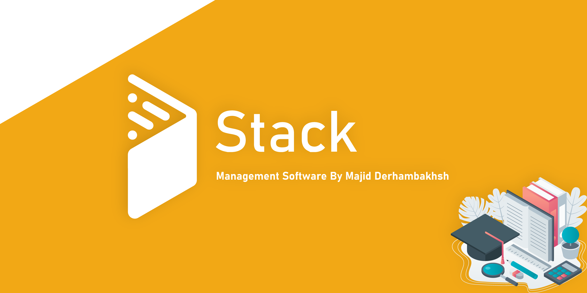

# Stack
Educational Center Management Software

### Version : 1.0.2.0

- #### Type : Windows Software.

- #### Support : Windows 7 and later.

- #### Properties :
    - Students, Personnels & Professors Register & Management System  
    - Integrated Financial Management System  
    - Integrated Storeroom Management  
    - Center Courses Management  
    
    - Report System In All Sections  
    - Smart Search & Filtering System  
    
    - SMS System  
      
    - AES256 Encoding System  
    - Automatic In-App Update  
    - Backup & Restore System (Offline and Online Database)  
    - Support Dark Mode & Material Design Themes  
    - Support Fingerprint & RFID Hardwares  
    
    - #### and more features

#### Download: 
    
   [Stack (v1.0.2.0)](https://mega.nz/file/5F5znBJB#U5ps3LhPV-80t8p14IeWsNAOx8rhzS8KVtydb2DAoIw) 79.3MB  
   [Stack - Without DotNet (v1.0.2.0)](https://mega.nz/file/sYgFzZYJ#X4eCsnekyDQN2R2zvqlMaEEWeswH8fCAovFtUnClO2k) 12.5MB  
    
#### Developer: Majid Derhambakhsh
